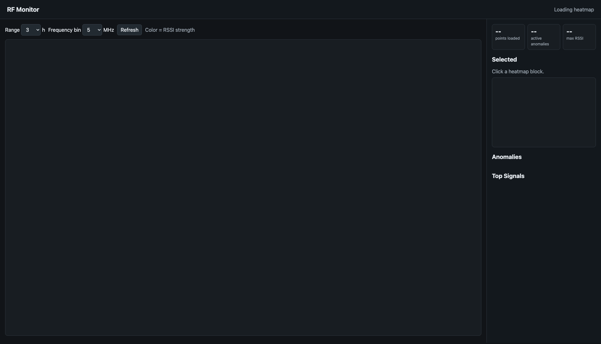
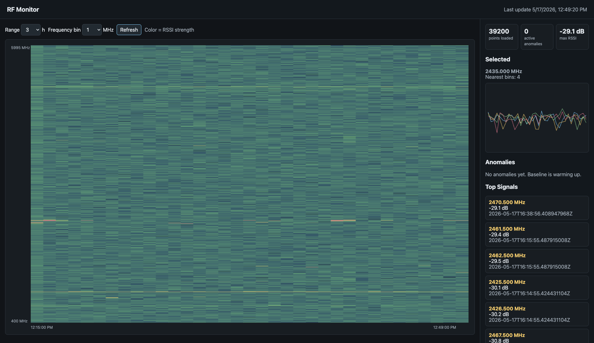
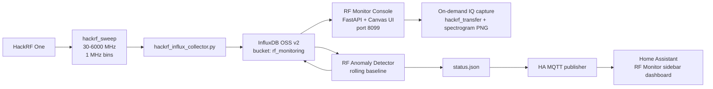
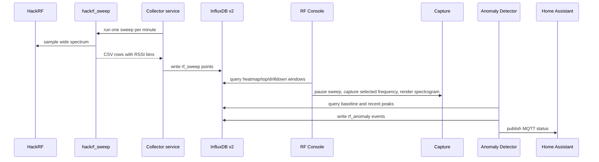

# LinuxGR RF Monitor

HackRF-based RF monitoring for `linuxGR`: sweep the local RF environment, store one RSSI point per frequency bin in InfluxDB, render a browser-based spectrum heatmap, and publish health/anomaly status into Home Assistant.

This repo is the working implementation for a home RF baseline/anomaly project. It is designed to answer:

- What RF energy is present across a wide frequency range right now?
- What changed compared with the recent baseline?
- Which frequency/time block should I drill into next?
- How can Home Assistant alert me without becoming the main RF analysis UI?





## Current Architecture



## Data Flow



## Components

### Collector

`hackrf-monitor/hackrf_influx_collector.py`

Runs `hackrf_sweep`, parses each CSV row, and writes InfluxDB line protocol. The important parser behavior is that bin count comes from the actual RSSI values in each `hackrf_sweep` row, not from the whole requested sweep span.

Example service config:

- `hackrf-monitor/hackrf-influx.service`
- `hackrf-monitor/hackrf-influx.env.example`

### RF Console

`rf-monitor/rf_monitor_console.py`

FastAPI app on port `8099`.

Main endpoints:

- `/` - browser UI
- `/api/heatmap` - frequency/time heatmap matrix
- `/api/frequency/{frequency_hz}` - neighboring-bin drilldown
- `/api/top` - strongest recent bins
- `/api/anomalies` - current anomaly list
- `/api/capture` - on-demand HackRF IQ capture for a selected frequency
- `/api/captures` - recent capture records and generated artifacts
- `/api/health` - Influx/service health

The console can capture a selected signal from the sidebar. A capture briefly pauses `hackrf-influx`, runs `hackrf_transfer`, stores raw unsigned 8-bit interleaved I/Q samples, generates a spectrogram PNG, then resumes the wideband sweep. The first deployed capture mode is intentionally conservative: short IQ captures with metadata and visual inspection before demodulation or classification.

Capture artifacts live on linuxGR under:

```text
/home/cmilkosk/rf-monitor/captures
```

Each capture produces:

- `{capture_id}.iq` - raw HackRF I/Q samples
- `{capture_id}.json` - frequency, sample rate, gain, command output, and analysis metadata
- `{capture_id}.png` - quick-look spectrogram

### Anomaly Detector

`rf-monitor/rf_anomaly_detector.py`

Runs once per minute. It computes a rolling median baseline per frequency and compares the recent peak against that baseline.

Default thresholds:

- Baseline window: `6h`
- Recent window: `3m`
- Minimum rise above baseline: `18 dB`
- Minimum RSSI: `-55 dB`

Anomaly events are written back to InfluxDB as `rf_anomaly`, and the latest status is written to `/home/cmilkosk/rf-monitor/status.json`.

### Home Assistant Publisher

`rf-monitor/publish_rf_ha_status.py`

Publishes MQTT discovery and status sensors for Home Assistant. HA is intentionally a status/alert surface, while the dedicated RF console remains the primary analysis UI.

## Installed Services On linuxGR

The live deployment uses:

```text
influxdb
hackrf-influx
rf-monitor-console
rf-anomaly-detector
rf-ha-status.timer
```

Useful checks:

```bash
systemctl status influxdb hackrf-influx rf-monitor-console rf-anomaly-detector
systemctl list-timers rf-ha-status.timer
journalctl -u hackrf-influx -f
journalctl -u rf-anomaly-detector -f
curl http://127.0.0.1:8099/api/health
```

## InfluxDB Model

InfluxDB OSS v2 is used deliberately. This repo expects the v2 bucket/org/token API, not InfluxDB v1 databases or InfluxDB 3 Core.

Primary bucket:

```text
org: home
bucket: rf_monitoring
retention: 30d
```

Measurements:

- `rf_sweep`
- `rf_anomaly`

`rf_sweep` tags:

- `source`
- `frequency_hz`
- `bin_width_hz`

`rf_sweep` fields:

- `rssi_db`
- `start_hz`
- `stop_hz`
- `samples`

## Home Assistant

The deployment creates a sidebar dashboard named `RF Monitor`, placed with the existing `Security` and `AI` dashboards.

The HA dashboard includes:

- Link to the RF console
- RF monitor status entities
- Embedded iframe of the RF console

MQTT status entities currently include:

```text
sensor.linuxgr_rf_monitor_linuxgr_rf_monitor_status
sensor.linuxgr_rf_monitor_linuxgr_rf_active_anomalies
sensor.linuxgr_rf_monitor_linuxgr_rf_last_update
sensor.linuxgr_rf_monitor_linuxgr_rf_delta_threshold
sensor.linuxgr_rf_monitor_linuxgr_rf_min_rssi
sensor.linuxgr_rf_monitor_linuxgr_rf_overview
```

## Why A Custom Console?

Grafana and Home Assistant are both useful, but neither is ideal as the primary RF analysis surface.

This UI needs to be RF-native:

- Dense frequency-vs-time heatmap
- Hover a heatmap block to read frequency, time, and RSSI
- Click a hot block to zoom into that frequency range
- Use the selected-frequency panel to drill into adjacent bins
- Capture raw IQ around a selected frequency
- Generate quick-look spectrograms for signal investigation
- Show anomaly overlays/events

Home Assistant remains the home-automation surface for status and alerts.

## Roadmap

Near-term:

- Add visible anomaly overlays to the heatmap
- Add presets for common bands
- Add CSV/PNG export for a selected frequency window
- Add capture notes and labels so interesting signals become an investigation log
- Tune anomaly thresholds after a few days of baseline data

Next phase:

- Add demodulation attempts for obvious analog voice/narrow FM captures
- Add signal investigation records with capture comparisons over time
- Connect known signal references such as Artemis/SigID

Later:

- Automatic modulation/signal classification
- Voice vs digital heuristics
- FT8 and other mode-specific detectors
- Model-assisted RF signal identification
